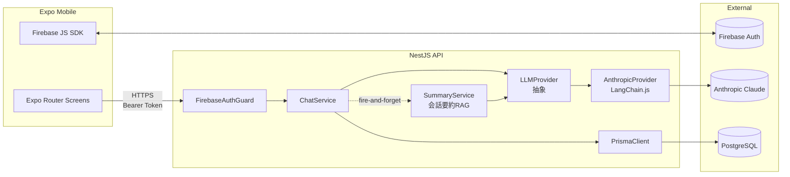

# ai_reaigame

AI×恋愛シミュレーションモバイルアプリ（2週間デモ版）。ヒロイン「花(hana)」と自由会話で関係を深めるポートフォリオ作品。

## 求人MUST要件のカバレッジ

| 要件 | 実装 |
| --- | --- |
| Claude Code / SDD | `docs/specs/MVP.md` と `.claude/commands/` で仕様駆動運用 |
| React | Expo (React Native) + Expo Router typed routes |
| NestJS / TypeScript | `apps/api` モジュール分割（auth / users / characters / chat / llm / rag） |
| PostgreSQL / Prisma | Prisma schema 4モデル + migrate + seed |
| Docker → ECR/ECS | `apps/api/Dockerfile` multi-stage + docker-compose。CDKはv2送り |
| AWS (Bedrock等) | `LLMProvider` 抽象、Anthropic API実装。Bedrockへは追加実装のみで差し替え可 |
| LLM / LangChain / RAG | `@langchain/anthropic` + `SummaryService`（会話要約でRAG相当） |
| Firebase Authentication | `FirebaseAuthGuard` + JS SDKログイン、未設定時はDEVバイパス |
| モノレポ | pnpm workspaces + Turborepo (`apps/*`, `packages/*`) |

## アーキテクチャ



### LLMProvider抽象でBedrock差し替えを想定

```
LLMProvider (interface)
├── AnthropicProvider   # 現在利用中 (LangChain + Anthropic API)
├── BedrockProvider     # v2で追加予定 (@langchain/aws の ChatBedrock)
└── StubProvider        # ANTHROPIC_API_KEY 未設定時 / テスト時
```

## 技術スタック

- **Frontend (Mobile)**: Expo SDK 52 / React Native 0.76 / Expo Router / TanStack Query / Firebase JS SDK v10
- **Backend**: NestJS 10 / TypeScript 5.6 / Prisma 5 / PostgreSQL 16
- **LLM**: Anthropic Claude Sonnet 4.6 via LangChain.js（`LLMProvider`でBedrock差し替え可）
- **Auth**: Firebase Authentication（ID Token検証 + DEVバイパス）
- **Infra**: Docker multi-stage / docker-compose / GitHub Actions CI

## ディレクトリ

```
apps/
  api/                # NestJS
  mobile/             # Expo
packages/
  shared/             # zodスキーマ/DTO
docs/specs/MVP.md     # SDD仕様書 (source of truth)
.claude/commands/     # Claude Code用スラッシュコマンド
.github/workflows/    # CI
docker-compose.yml    # Postgres (+ api profile)
```

## ローカル起動（開発）

### 1. 依存インストール

```bash
pnpm install
```

### 2. 環境変数

```bash
cp apps/api/.env.example apps/api/.env
# ANTHROPIC_API_KEY を設定。未設定でも LLM はスタブ応答で動作
# FIREBASE_* を設定。未設定なら API は DEV バイパスモード
```

### 3. Postgres起動 + マイグレーション + シード

```bash
docker compose up -d postgres
pnpm --filter @ai-reaigame/api prisma migrate dev --name init
pnpm --filter @ai-reaigame/api prisma:seed
```

### 4. API + モバイル起動

```bash
# ターミナル1
pnpm --filter @ai-reaigame/api dev

# ターミナル2
pnpm --filter @ai-reaigame/mobile start
```

Expo Go で QR を読み、実機から接続する。DEVモードなら任意のUID（例: `demo-user`）でログイン。

### 5. Docker で API を丸ごと起動する場合

```bash
docker compose --profile full up --build
```

## SDD運用

`docs/specs/MVP.md` が single source of truth。Claude Code で `/implement` コマンドを使うと自動で spec 参照を強制します。

## 主要機能（MVP）

1. Firebaseログイン / DEVバイパス（US-01）
2. ヒロイン一覧 + プロフィール（US-02）
3. 冒頭シーンのノベル演出（US-03）
4. AI自由会話（LangChain + Claude）（US-04）
5. 好感度メーター with リアルタイムdelta表示（US-05）
6. 会話履歴と好感度の永続化（US-06）
7. 10発話ごとに自動で会話要約（RAG）を生成してプロンプトに再注入

## 次のステップ（v2）

- AWS CDK → ECR/ECS Fargate/RDSへ実デプロイ
- `LLMProvider` に Bedrock 実装を追加
- pgvector を使った本格RAG（会話埋め込み検索）
- YAML駆動のシナリオエンジン
- 2人目以降のヒロイン / CG・音声
- RevenueCat 課金 / TestFlight 配信

## ライセンス

MIT
